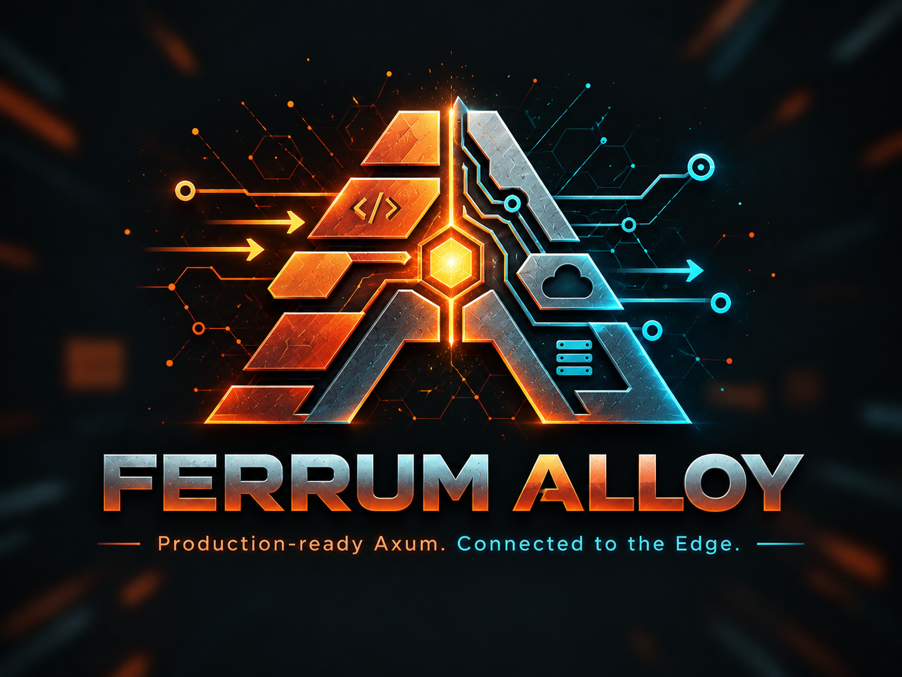

<p align="center">
  
</p>

<h1 align="center">Ferrum Alloy</h1>

<p align="center"><b>Production-ready Axum. Connected to the Edge.</b></p>

<p align="center">
  <a href="https://github.com/ferrum-edge/ferrum-alloy/actions/workflows/ci.yml"></a>
  <a href="https://github.com/ferrum-edge/ferrum-alloy/blob/main/LICENSE"></a>
  
  
  <a href="https://docs.rs/axum"></a>
  
</p>

Ferrum Alloy is a batteries-included toolkit for Rust API services built on [Axum](https://docs.rs/axum). It takes care of the repetitive production setup: configuration, errors, health, limits, graceful shutdown, and request telemetry. Handlers, extractors, state, routers, and Tower middleware stay ordinary Axum.

Alloy works on its own. Behind [Ferrum Edge](https://github.com/ferrum-edge/ferrum-edge), it also shows a verified request story shared with the gateway. You can see which gateway span each service span belongs to and whether the gateway's identity was cryptographically verified. You can also see what the evidence does and does not prove about where the time went.

> **Pre-release.** Nothing is published to crates.io yet, and APIs and contracts may change. [Implementation status](docs/implementation-status.md) lists exactly what is implemented and tested.

## Quick start

```rust
use axum::{Router, routing::get};
use ferrum_alloy::AlloyApp;

async fn hello() -> &'static str {
    "Hello from Ferrum Alloy"
}

#[tokio::main]
async fn main() -> Result<(), Box<dyn std::error::Error>> {
    let router = Router::new().route("/hello", get(hello));

    AlloyApp::new("hello-api").router(router).run().await?;

    Ok(())
}
```

You can adopt it in two ways:

| | How |
|---|---|
| **New service** | Run `ferrum-alloy new orders-api`, or use `AlloyApp` directly. |
| **Existing Axum app** | Add only `ferrum-alloy-telemetry`, a Tower layer. You keep your runtime, subscriber, router, and server. |

To go further, read [Getting started](docs/getting-started.md).

## Features

| Area | What you get |
|---|---|
| **Configuration** | Typed and strict. Precedence is builder, then `FERRUM_ALLOY_*`, then TOML, then defaults. Secrets are redacted. See [configuration](docs/configuration.md). |
| **Errors** | RFC 9457 Problem Details for framework errors and Problem-returning extractors. Application bodies are never rewritten. |
| **Health** | Minimal liveness, cached single-flight readiness, and a draining state. Detailed health sits on a token-protected management listener. |
| **Limits & lifecycle** | Body, header, connection, and admission limits. A deadline on time to response headers, which never cuts SSE streams. SIGTERM draining with a time budget and forced close. |
| **Truthful telemetry** | Request ids and route-template metrics. W3C trace context is accepted only from trusted transport peers. Accounting ends exactly once, when the response *body* ends. OTLP export is bounded and counts any loss. |
| **Optional batteries** | Cargo features: `otel`, `tls` (rustls with verified client identity), `edge`, `postgres` (SQLx), `openapi` (utoipa), `jwt` (JWKS), `http-client`, `compression`, and `cors`. |

### CLI

| Command | Purpose |
|---|---|
| `ferrum-alloy new` | Creates a starter project that compiles and passes its own tests |
| `ferrum-alloy check` | Validates configuration |
| `ferrum-alloy openapi export` | Exports the OpenAPI spec and detects drift |
| `ferrum-alloy edge export` | Exports Edge file-mode or GitForgeOps YAML, validated by the real gateway |
| `ferrum-alloy diagnose` | Explains evidence offline, with deterministic rules |

## Workspace

| Crate | Purpose |
|---|---|
| [`ferrum-alloy`](crates/ferrum-alloy) | `AlloyApp`, configuration, server, problems, health, limits, and optional batteries |
| [`ferrum-alloy-telemetry`](crates/ferrum-alloy-telemetry) | Tower/Axum instrumentation that works on its own, trust classification, and the OpenTelemetry bridge |
| [`ferrum-alloy-edge`](crates/ferrum-alloy-edge) | Ferrum Edge contracts, gateway trust modes, the service manifest, and config export |
| [`ferrum-alloy-diagnostics`](crates/ferrum-alloy-diagnostics) | Versioned evidence schema, bounded parser, deterministic rules, and OTLP/JSON import |
| [`ferrum-alloy-cli`](crates/ferrum-alloy-cli) | The `ferrum-alloy` command |
| [`examples/`](examples) | `minimal`, `existing-axum`, `postgres-api`, `edge-observability` (real Edge and Collector), and `bench` (overhead harness) |

## Documentation

| Guide | |
|---|---|
| [Getting started](docs/getting-started.md) | First service, and adding Alloy to an existing app |
| [Configuration](docs/configuration.md) | Every setting and environment variable |
| [Measurement semantics](docs/measurement-semantics.md) | What every timing means |
| [Security model](docs/security.md) | Trust boundaries and peer identity |
| [Edge contract inventory](docs/edge-contract-inventory.md) | Contracts with Ferrum Edge, both implemented and proposed |
| [Compatibility](docs/compatibility.md) | The exact tested matrix |
| [Architecture decisions](docs/adr/README.md) | ADRs |
| [Implementation status](docs/implementation-status.md) | What is built and tested |
| [Benchmarks](docs/benchmarks.md) | Local, same-host overhead measurements and their limits |

## Development

```bash
cargo fmt --all -- --check
cargo clippy --workspace --all-targets --all-features -- -D warnings
cargo test --workspace --all-features
cargo test -p ferrum-alloy-cli --test cli -- --ignored   # generate, build, and test starter projects
cargo deny check
```

The Ferrum Edge end-to-end stack is defined in [`examples/edge-observability/compose.yaml`](examples/edge-observability/compose.yaml).

## Related projects

- [Ferrum Edge](https://github.com/ferrum-edge/ferrum-edge): a high-performance edge proxy built in Rust
- [Ferrum Foundry](https://github.com/ferrum-edge/ferrum-foundry): an admin panel for Ferrum Edge
- [Ferrum Nexus](https://github.com/ferrum-edge/ferrum-nexus): a developer portal and workflow layer for Ferrum Edge

## License

Ferrum Alloy is licensed under [PolyForm Noncommercial 1.0.0](LICENSE), and commercial licensing is available ([LICENSE-COMMERCIAL.md](LICENSE-COMMERCIAL.md)). "Ferrum Alloy" and the crate and command names are working names. Registry and trademark availability has not been verified.
